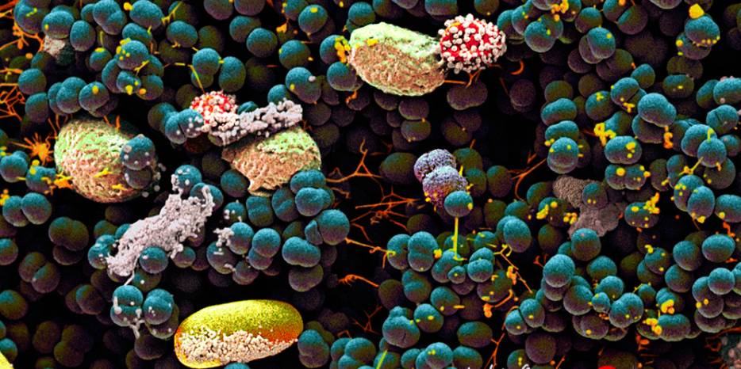

# Plot.ly Homework - Belly Button Biodiversity

Build an interactive dashboard to explore the [Belly Button Biodiversity dataset](http://robdunnlab.com/projects/belly-button-biodiversity/), which catalogs the microbes that colonize human navels.

The dataset reveals that a small handful of microbial species (also called operational taxonomic units, or OTUs, in the study) were present in more than 70% of people, while the rest were relatively rare.

## Dashboard 

1. Create a horizontal bar chart with a dropdown menu to display the top 10 OTUs found in that individual.

2. Create a bubble chart that displays each sample.

3. Display the sample metadata, i.e., an individual's demographic information.

4. Display each key-value pair from the metadata JSON object somewhere on the page.

5. Update all of the plots any time that a new sample is selected

### About the Data

Hulcr, J. et al.(2012) _A Jungle in There: Bacteria in Belly Buttons are Highly Diverse, but Predictable_. Retrieved from: [http://robdunnlab.com/projects/belly-button-biodiversity/results-and-data/](http://robdunnlab.com/projects/belly-button-biodiversity/results-and-data/)

